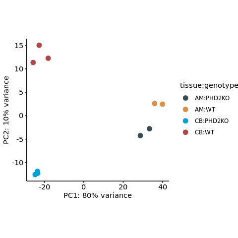
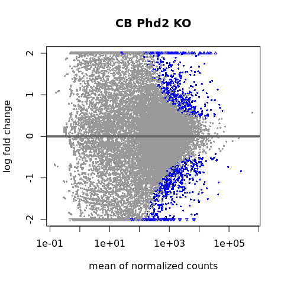
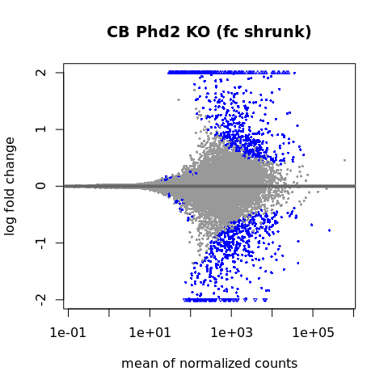
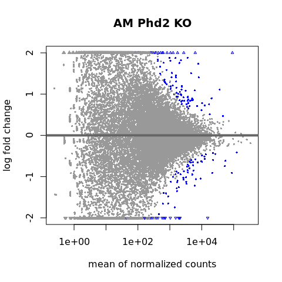
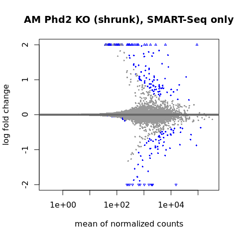
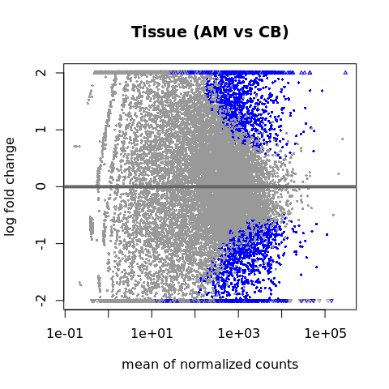
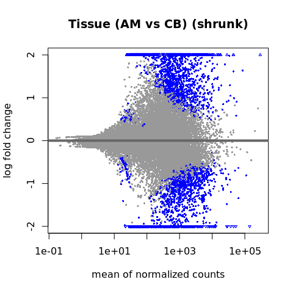
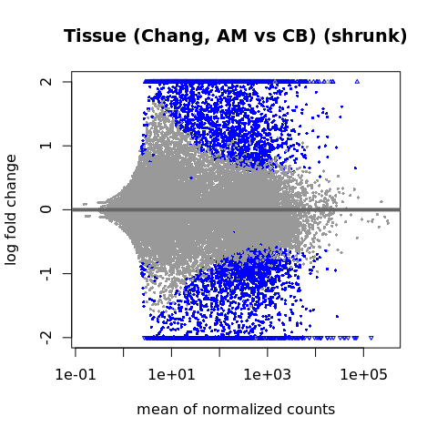

# Overview

Analysis of differentially expressed genes will be performed using `DESeq2`.


# Setup


```r
project.dir <- "/fast/AG_Sugimoto/home/users/yoichiro/projects/20230620_Phd2KO_in_AM_and_CB"

renv::restore("/fast/AG_Sugimoto/home/users/yoichiro/projects/20230620_Phd2KO_in_AM_and_CB/R")
```

```
## * The library is already synchronized with the lockfile.
```

```r
library("DESeq2")
library("tximport")
library("apeglm")

processors <- 7

temp <- sapply(list.files(
    file.path(project.dir, "R/functions"),
    full.names = TRUE
), source)
```

## The input and output files and the directories


```r
annot.dir <- file.path(project.dir, "annotation/")
annot.ps.dir <- file.path(annot.dir, "mm39_annotation/processed_data/")

results.dir <- file.path(project.dir, "results")
s1.dir <- file.path(results.dir, "s1")
s2.dir <- file.path(results.dir, "s2")

create.dirs(c(
    s2.dir
))
```

# Import data


```r
sample.dt <- file.path(
    project.dir, "data/sample_data/20210401_sample_data.csv"
) %>% fread

## By setting leves in this way, log2 fold change will show CB / AM and PHD2KO / WT
sample.dt[, `:=`(
    tissue = factor(tissue, levels = c("AM", "CB")),
    Phd2 = factor(Phd2, levels = c("WT", "PHD2KO"))
)]

## Public sample data
public.sample.dt <- file.path(
    project.dir, "data/sample_data/public_data_source.csv"
) %>% fread

public.sample.dt[, `:=`(
    tissue = str_split_fixed(sample_name, "_", n = 3)[, 2] %>%
        factor(levels = c("AM", "CB"))
)]


## Annotation
all.tx.dt <- file.path(
    annot.ps.dir, "all-tx-info.csv"
) %>%
    fread

tx2gene.dt <- all.tx.dt[, .(transcript_id, gene_id)]
setnames(
    tx2gene.dt,
    old = c("transcript_id", "gene_id"),
    new = c("TXNAME", "GENEID")
)

all.gene.dt <- all.tx.dt[!duplicated(gene_id)][
  , .(gene_id, gene_name, gene_type, seqnames)
]
```

# Analysis of differential expressed genes

## DESeq2 object construction


```r
createDESeq2Object <- function(sl.sample.dt, design.formula){
    tx.files <- file.path(
        s1.dir,
        sl.sample.dt[, sample_name],
        "quant.sf"
    )

    names(tx.files) <- sl.sample.dt[, sample_name]

    txi <- tximport(tx.files, type = "salmon", tx2gene = tx2gene.dt)

    dds <- DESeqDataSetFromTximport(
        txi,
        colData = sl.sample.dt,
        design = design.formula
    )

    return(dds)
}

dds.all <- createDESeq2Object(
    sl.sample.dt = sample.dt,
    design.formula = ~ tissue + Phd2 + tissue:Phd2
)
```

```
## reading in files with read.delim (install 'readr' package for speed up)
```

```
## 1 2 3 4 5 6 7 8 9 10 
## summarizing abundance
## summarizing counts
## summarizing length
## using counts and average transcript lengths from tximport
```

```r
vsd <- vst(dds.all, blind = TRUE)
```

```
## using 'avgTxLength' from assays(dds), correcting for library size
```

```r
extractTPM <- function(sl.sample.dt){
    tx.files <- file.path(
        s1.dir,
        sl.sample.dt[, sample_name],
        "quant.sf"
    )

    names(tx.files) <- sl.sample.dt[, sample_name]

    txi <- tximport(
        tx.files, type = "salmon", tx2gene = tx2gene.dt,
        countsFromAbundance = "no"
    )

    count.dt <- as.data.frame(txi$abundance) %>% data.table(keep.rownames = "gene_id")
    
    return(count.dt)
}

extractCount <- function(sl.sample.dt){
    tx.files <- file.path(
        s1.dir,
        sl.sample.dt[, sample_name],
        "quant.sf"
    )

    names(tx.files) <- sl.sample.dt[, sample_name]

    txi <- tximport(
        tx.files, type = "salmon", tx2gene = tx2gene.dt,
        countsFromAbundance = "no"
    )

    count.dt <- as.data.frame(txi$counts) %>% data.table(keep.rownames = "gene_id")
    
    return(count.dt)
}


tpm.count.dt <- extractTPM(sample.dt)
```

```
## reading in files with read.delim (install 'readr' package for speed up)
## 1 2 3 4 5 6 7 8 9 10 
## summarizing abundance
## summarizing counts
## summarizing length
```

```r
fwrite(
    tpm.count.dt,
    file.path(s2.dir, "TPM.csv")
)

raw.count.dt <- extractCount(sample.dt)
```

```
## reading in files with read.delim (install 'readr' package for speed up)
## 1 2 3 4 5 6 7 8 9 10 
## summarizing abundance
## summarizing counts
## summarizing length
```

```r
fwrite(
    raw.count.dt,
    file.path(s2.dir, "count.csv")
)

save(
    dds.all, vsd, tpm.count.dt,
    file = file.path(s2.dir, "DESeq2-data-consolidated.Rdata")
)
```


```r
plotPCA(
    vsd, intgroup=c("tissue", "Phd2")
) +
    geom_point(size = 3) +
    labs(color = "tissue:genotype") +
    ggsci::scale_color_jama() +
    theme(
        aspect.ratio = 1
    )
```

<!-- -->


## Definition of a function


```r
extractPerConditionBaseMean <- function(sl.sample.dt, sl.conditions = c("WT", "PHD2KO"), condition.idx = 2){
    ## sl.conditions: conditions to be compared
    ## condition.idx: position of the sl.conditions (e.g. CB_WT_A)
    
    tx.files <- file.path(
        s1.dir,
        sl.sample.dt[, sample_name],
        "quant.sf"
    )

    names(tx.files) <- sl.sample.dt[, sample_name]

    txi <- tximport(
        tx.files, type = "salmon", tx2gene = tx2gene.dt,
        countsFromAbundance = "no"
    )

    count.dt <- as.data.frame(txi$abundance) %>% data.table(keep.rownames = "gene_id")
    
    d.count.dt <- melt(
        count.dt,
        id.vars = "gene_id"
    ) %>%
        {.[, condition := case_when(
                 str_split_fixed(variable, "_", n = 3)[, condition.idx] == sl.conditions[1] ~
                     paste0("TPM_", sl.conditions[1]),
                 str_split_fixed(variable, "_", n = 3)[, condition.idx] == sl.conditions[2] ~
                     paste0("TPM_", sl.conditions[2])
             )]} %>%
        {.[, list(TPM = mean(value)), by = list(condition, gene_id)]} %>%
        dcast(gene_id ~ condition, value.var = "TPM")
    
    return(d.count.dt)
}
```

## Analysis

### CB Phd2 KO

For this analysis, all CB samples will be analysed.


```r
res.cb.count.dt <- extractPerConditionBaseMean(
    sl.sample.dt = sample.dt[tissue == "CB"]
)
```

```
## reading in files with read.delim (install 'readr' package for speed up)
```

```
## 1 2 3 4 5 6 
## summarizing abundance
## summarizing counts
## summarizing length
```

```r
dds.cb <- createDESeq2Object(
    sl.sample.dt = sample.dt[tissue == "CB"],
    design.formula = ~ batch + Phd2
)
```

```
## reading in files with read.delim (install 'readr' package for speed up)
## 1 2 3 4 5 6 
## summarizing abundance
## summarizing counts
## summarizing length
```

```
## Warning in DESeqDataSet(se, design = design, ignoreRank): some variables in
## design formula are characters, converting to factors
```

```
## using counts and average transcript lengths from tximport
```

```r
dds.cb <- DESeq(
    dds.cb,
    test = "LRT",
    reduced = ~ batch
)
```

```
## estimating size factors
## using 'avgTxLength' from assays(dds), correcting for library size
## estimating dispersions
## gene-wise dispersion estimates
## mean-dispersion relationship
## final dispersion estimates
## fitting model and testing
```

```r
res.cb.dt <- results(dds.cb) %T>%
    plotMA(ylim = c(-2,2), main = "CB Phd2 KO") %>%
    as.data.frame %>%
    data.table(keep.rownames = "gene_id") %>%
    {.[, .(gene_id, log2FoldChange, padj)]}
```

<!-- -->

```r
setnames(res.cb.dt, old = "log2FoldChange", new = "log2fc")

res.shrfc.cb.dt <- lfcShrink(
    dds.cb,
    coef = "Phd2_PHD2KO_vs_WT",
    type = "apeglm"
) %T>%
    plotMA(ylim = c(-2,2), main = "CB Phd2 KO (fc shrunk)") %>%
    as.data.frame %>%
data.table(keep.rownames = "gene_id")
```

```
## using 'apeglm' for LFC shrinkage. If used in published research, please cite:
##     Zhu, A., Ibrahim, J.G., Love, M.I. (2018) Heavy-tailed prior distributions for
##     sequence count data: removing the noise and preserving large differences.
##     Bioinformatics. https://doi.org/10.1093/bioinformatics/bty895
```

<!-- -->

```r
res.shrfc.cb.dt <- res.shrfc.cb.dt[, .(gene_id, log2FoldChange)]
setnames(res.shrfc.cb.dt, old = "log2FoldChange", new = "shrlog2fc")

res.cb.dt <- Reduce(
    function(...) merge(..., all = TRUE, by = "gene_id"),
    list(
        res.cb.dt,
        res.cb.count.dt,
        res.shrfc.cb.dt
    ))

key.data.cols <- c("TPM_WT", "TPM_PHD2KO", "log2fc", "shrlog2fc", "padj")

res.cb.dt <- res.cb.dt[, c("gene_id", key.data.cols), with = FALSE]

setnames(
    res.cb.dt,
    old = key.data.cols,
    new = paste0(key.data.cols, "__CB_PHD2KO")
)
```

### AM Phd2 KO


```r
res.rd.am.count.dt <- extractPerConditionBaseMean(
    sl.sample.dt = sample.dt[tissue == "AM"]
)
```

```
## reading in files with read.delim (install 'readr' package for speed up)
```

```
## 1 2 3 4 
## summarizing abundance
## summarizing counts
## summarizing length
```

```r
rd.dds.am <- createDESeq2Object(
    sl.sample.dt = sample.dt[tissue == "AM"],
    design.formula = ~ batch + Phd2
)
```

```
## reading in files with read.delim (install 'readr' package for speed up)
## 1 2 3 4 
## summarizing abundance
## summarizing counts
## summarizing length
```

```
## Warning in DESeqDataSet(se, design = design, ignoreRank): some variables in
## design formula are characters, converting to factors
```

```
## using counts and average transcript lengths from tximport
```

```r
rd.dds.am <- DESeq(
    rd.dds.am,
    test = "LRT",
    reduced = ~ batch
)
```

```
## estimating size factors
## using 'avgTxLength' from assays(dds), correcting for library size
## estimating dispersions
## gene-wise dispersion estimates
## mean-dispersion relationship
## final dispersion estimates
## fitting model and testing
```

```r
res.rd.am.dt <- results(rd.dds.am) %T>%
    plotMA(ylim = c(-2,2), main = "AM Phd2 KO (SMART-Seq only)") %>%
    as.data.frame %>%
    data.table(keep.rownames = "gene_id") %>%
    {.[, .(gene_id, log2FoldChange, padj)]}
```

<!-- -->

```r
setnames(res.rd.am.dt, old = "log2FoldChange", new = "log2fc")

res.shrfc.rd.am.dt <- lfcShrink(
    rd.dds.am,
    coef = "Phd2_PHD2KO_vs_WT",
    type = "apeglm"
) %T>%
    plotMA(ylim = c(-2,2), main = "AM Phd2 KO (shrunk), SMART-Seq only") %>%
    as.data.frame %>%
data.table(keep.rownames = "gene_id")
```

```
## using 'apeglm' for LFC shrinkage. If used in published research, please cite:
##     Zhu, A., Ibrahim, J.G., Love, M.I. (2018) Heavy-tailed prior distributions for
##     sequence count data: removing the noise and preserving large differences.
##     Bioinformatics. https://doi.org/10.1093/bioinformatics/bty895
```

<!-- -->

```r
res.shrfc.rd.am.dt <- res.shrfc.rd.am.dt[, .(gene_id, log2FoldChange)]
setnames(res.shrfc.rd.am.dt, old = "log2FoldChange", new = "shrlog2fc")

res.rd.am.dt <- Reduce(
    function(...) merge(..., all = TRUE, by = "gene_id"),
    list(
        res.rd.am.dt,
        res.rd.am.count.dt,
        res.shrfc.rd.am.dt
    ))

res.rd.am.dt <- res.rd.am.dt[, c("gene_id", key.data.cols), with = FALSE]

setnames(
    res.rd.am.dt,
    old = key.data.cols,
    new = paste0(key.data.cols, "__AM_PHD2KO")
)
```


### Tissue differences

Only wild-type data will be analysed.


```r
res.tissue2.count.dt <- extractPerConditionBaseMean(
    sl.sample.dt = sample.dt[Phd2 == "WT"],
    sl.conditions = c("AM", "CB"),
    condition.idx = 1
)
```

```
## reading in files with read.delim (install 'readr' package for speed up)
```

```
## 1 2 3 4 5 
## summarizing abundance
## summarizing counts
## summarizing length
```

```r
dds.tissue2 <- createDESeq2Object(
    sl.sample.dt = sample.dt[Phd2 == "WT"],
    design.formula = ~ tissue
)
```

```
## reading in files with read.delim (install 'readr' package for speed up)
## 1 2 3 4 5 
## summarizing abundance
## summarizing counts
## summarizing length
## using counts and average transcript lengths from tximport
```

```r
dds.tissue2 <- DESeq(
    dds.tissue2,
    test = "LRT",
    reduced = ~ 1 
)
```

```
## estimating size factors
## using 'avgTxLength' from assays(dds), correcting for library size
## estimating dispersions
## gene-wise dispersion estimates
## mean-dispersion relationship
## final dispersion estimates
## fitting model and testing
```

```r
res.tissue2.dt <- results(dds.tissue2) %T>%
    plotMA(ylim = c(-2,2), main = "Tissue (AM vs CB)") %>%
    as.data.frame %>%
    data.table(keep.rownames = "gene_id") %>%
    {.[, .(gene_id, log2FoldChange, padj)]}
```

<!-- -->

```r
setnames(res.tissue2.dt, old = "log2FoldChange", new = "log2fc")

res.shrfc.tissue2.dt <- lfcShrink(
    dds.tissue2,
    coef = "tissue_CB_vs_AM",
    type = "apeglm"
) %T>%
    plotMA(ylim = c(-2,2), main = "Tissue (AM vs CB) (shrunk)") %>%
    as.data.frame %>%
data.table(keep.rownames = "gene_id")
```

```
## using 'apeglm' for LFC shrinkage. If used in published research, please cite:
##     Zhu, A., Ibrahim, J.G., Love, M.I. (2018) Heavy-tailed prior distributions for
##     sequence count data: removing the noise and preserving large differences.
##     Bioinformatics. https://doi.org/10.1093/bioinformatics/bty895
```

<!-- -->

```r
res.shrfc.tissue2.dt <- res.shrfc.tissue2.dt[, .(gene_id, log2FoldChange)]
setnames(res.shrfc.tissue2.dt, old = "log2FoldChange", new = "shrlog2fc")

res.tissue2.dt <- Reduce(
    function(...) merge(..., all = TRUE, by = "gene_id"),
    list(
        res.tissue2.dt,
        res.tissue2.count.dt,
        res.shrfc.tissue2.dt
    ))

key.data.cols.2 <- c("TPM_AM", "TPM_CB", "log2fc", "shrlog2fc", "padj")

res.tissue2.dt <- res.tissue2.dt[, c("gene_id", key.data.cols.2), with = FALSE]

setnames(
    res.tissue2.dt,
    old = key.data.cols.2,
    new = paste0(key.data.cols.2, "__Tissue")
)
```


### Tissue differences using the data by Chang et al.


```r
dds.public <- createDESeq2Object(
    sl.sample.dt = public.sample.dt,
    design.formula = ~ tissue
)
```

```
## reading in files with read.delim (install 'readr' package for speed up)
```

```
## 1 2 3 4 5 6 
## summarizing abundance
## summarizing counts
## summarizing length
## using counts and average transcript lengths from tximport
```

```r
res.public.count.dt <- extractPerConditionBaseMean(
    sl.sample.dt = public.sample.dt,
    sl.conditions = c("AM", "CB"),
    condition.idx = 2
)
```

```
## reading in files with read.delim (install 'readr' package for speed up)
## 1 2 3 4 5 6 
## summarizing abundance
## summarizing counts
## summarizing length
```

```r
dds.public <- DESeq(
    dds.public,
    test = "LRT",
    reduced = ~ 1
)
```

```
## estimating size factors
## using 'avgTxLength' from assays(dds), correcting for library size
## estimating dispersions
## gene-wise dispersion estimates
## mean-dispersion relationship
## final dispersion estimates
## fitting model and testing
```

```r
public.res.dt <- results(dds.public) %>%
    as.data.frame %>%
    data.table(keep.rownames = "gene_id")
setnames(public.res.dt, old = "log2FoldChange", new = "log2fc")

res.shrfc.public.dt <- lfcShrink(
    dds.public,
    coef = "tissue_CB_vs_AM",
    type = "apeglm"
) %T>%
    plotMA(ylim = c(-2,2), main = "Tissue (Chang, AM vs CB) (shrunk)") %>%
    as.data.frame %>%
data.table(keep.rownames = "gene_id")
```

```
## using 'apeglm' for LFC shrinkage. If used in published research, please cite:
##     Zhu, A., Ibrahim, J.G., Love, M.I. (2018) Heavy-tailed prior distributions for
##     sequence count data: removing the noise and preserving large differences.
##     Bioinformatics. https://doi.org/10.1093/bioinformatics/bty895
```

<!-- -->

```r
res.shrfc.public.dt <- res.shrfc.public.dt[, .(gene_id, log2FoldChange)]
setnames(res.shrfc.public.dt, old = "log2FoldChange", new = "shrlog2fc")

public.res.dt <- Reduce(
    function(...) merge(..., all = TRUE, by = "gene_id"),
    list(
        public.res.dt,
        res.public.count.dt,
        res.shrfc.public.dt
    ))

public.res.dt <- public.res.dt[, c("gene_id", key.data.cols.2), with = FALSE]

setnames(
    public.res.dt,
    old = key.data.cols.2,
    new = paste0(key.data.cols.2, "__Tissue_Chang")
)
```

# Export the results


```r
res.summary.dt <- Reduce(
    function(...) merge(..., all = TRUE, by = "gene_id"),
    list(all.gene.dt, res.cb.dt, res.rd.am.dt, res.tissue2.dt, public.res.dt)
)


fwrite(
    res.summary.dt,
    file.path(s2.dir, "de-summary-consolidated.csv")
)
```


# Session information


```r
sessioninfo::session_info()
```

```
## ─ Session info ───────────────────────────────────────────────────────────────
##  setting  value
##  version  R version 4.2.1 (2022-06-23)
##  os       CentOS Linux 7 (Core)
##  system   x86_64, linux-gnu
##  ui       X11
##  language (EN)
##  collate  en_GB.UTF-8
##  ctype    en_GB.UTF-8
##  tz       Europe/Berlin
##  date     2023-06-23
##  pandoc   2.19.2 @ /fast/AG_Sugimoto/home/users/yoichiro/software/miniconda3/envs/20220601_CB_AM_PHD2/bin/ (via rmarkdown)
## 
## ─ Packages ───────────────────────────────────────────────────────────────────
##  package              * version    date (UTC) lib source
##  annotate               1.74.0     2022-04-26 [1] Bioconductor
##  AnnotationDbi          1.60.0     2022-11-01 [1] Bioconductor
##  apeglm               * 1.20.0     2022-11-01 [1] Bioconductor
##  bbmle                  1.0.25     2022-05-11 [1] CRAN (R 4.2.1)
##  bdsmatrix              1.3-6      2022-06-03 [1] CRAN (R 4.2.1)
##  Biobase              * 2.56.0     2022-04-26 [1] Bioconductor
##  BiocGenerics         * 0.42.0     2022-04-26 [1] Bioconductor
##  BiocManager            1.30.18    2022-05-18 [1] CRAN (R 4.2.1)
##  BiocParallel           1.30.4     2022-10-11 [1] Bioconductor
##  Biostrings             2.64.1     2022-08-18 [1] Bioconductor
##  bit                    4.0.4      2020-08-04 [1] CRAN (R 4.2.1)
##  bit64                  4.0.5      2020-08-30 [1] CRAN (R 4.2.1)
##  bitops                 1.0-7      2021-04-24 [1] CRAN (R 4.2.1)
##  blob                   1.2.3      2022-04-10 [1] CRAN (R 4.2.1)
##  bslib                  0.4.0      2022-07-16 [1] CRAN (R 4.2.1)
##  cachem                 1.0.6      2021-08-19 [1] CRAN (R 4.2.1)
##  cli                    3.4.1      2022-09-23 [1] CRAN (R 4.2.1)
##  coda                   0.19-4     2020-09-30 [1] CRAN (R 4.2.1)
##  codetools              0.2-18     2020-11-04 [1] CRAN (R 4.2.1)
##  colorspace             2.0-3      2022-02-21 [1] CRAN (R 4.2.1)
##  crayon                 1.5.2      2022-09-29 [1] CRAN (R 4.2.1)
##  data.table           * 1.14.4     2022-10-17 [1] CRAN (R 4.2.1)
##  DBI                    1.1.3      2022-06-18 [1] CRAN (R 4.2.1)
##  DelayedArray           0.22.0     2022-04-26 [1] Bioconductor
##  DESeq2               * 1.36.0     2022-04-26 [1] Bioconductor
##  digest                 0.6.30     2022-10-18 [1] CRAN (R 4.2.1)
##  dplyr                * 1.0.10     2022-09-01 [1] CRAN (R 4.2.1)
##  emdbook                1.3.12     2020-02-19 [1] CRAN (R 4.2.1)
##  evaluate               0.17       2022-10-07 [1] CRAN (R 4.2.1)
##  fansi                  1.0.3      2022-03-24 [1] CRAN (R 4.2.1)
##  farver                 2.1.1      2022-07-06 [1] CRAN (R 4.2.1)
##  fastmap                1.1.0      2021-01-25 [1] CRAN (R 4.2.1)
##  genefilter             1.78.0     2022-04-26 [1] Bioconductor
##  geneplotter            1.74.0     2022-04-26 [1] Bioconductor
##  generics               0.1.3      2022-07-05 [1] CRAN (R 4.2.1)
##  GenomeInfoDb         * 1.32.4     2022-09-06 [1] Bioconductor
##  GenomeInfoDbData       1.2.8      2022-10-21 [1] Bioconductor
##  GenomicRanges        * 1.48.0     2022-04-26 [1] Bioconductor
##  ggplot2              * 3.3.6      2022-05-03 [1] CRAN (R 4.2.1)
##  ggsci                  2.9        2018-05-14 [1] CRAN (R 4.2.1)
##  glue                   1.6.2      2022-02-24 [1] CRAN (R 4.2.1)
##  gtable                 0.3.1      2022-09-01 [1] CRAN (R 4.2.1)
##  highr                  0.9        2021-04-16 [1] CRAN (R 4.2.1)
##  htmltools              0.5.3      2022-07-18 [1] CRAN (R 4.2.1)
##  httr                   1.4.4      2022-08-17 [1] CRAN (R 4.2.1)
##  IRanges              * 2.30.1     2022-08-18 [1] Bioconductor
##  jquerylib              0.1.4      2021-04-26 [1] CRAN (R 4.2.1)
##  jsonlite               1.8.2      2022-10-02 [1] CRAN (R 4.2.1)
##  KEGGREST               1.36.3     2022-07-12 [1] Bioconductor
##  khroma               * 1.9.0      2022-06-18 [1] CRAN (R 4.2.1)
##  knitr                * 1.40       2022-08-24 [1] CRAN (R 4.2.1)
##  labeling               0.4.2      2020-10-20 [1] CRAN (R 4.2.1)
##  lattice                0.20-45    2021-09-22 [1] CRAN (R 4.2.1)
##  lifecycle              1.0.3      2022-10-07 [1] CRAN (R 4.2.1)
##  locfit                 1.5-9.6    2022-07-11 [1] CRAN (R 4.2.1)
##  magrittr             * 2.0.3      2022-03-30 [1] CRAN (R 4.2.1)
##  MASS                   7.3-58.1   2022-08-03 [1] CRAN (R 4.2.1)
##  Matrix                 1.5-1      2022-09-13 [1] CRAN (R 4.2.1)
##  MatrixGenerics       * 1.8.1      2022-06-26 [1] Bioconductor
##  matrixStats          * 0.62.0     2022-04-19 [1] CRAN (R 4.2.1)
##  memoise                2.0.1      2021-11-26 [1] CRAN (R 4.2.1)
##  munsell                0.5.0      2018-06-12 [1] CRAN (R 4.2.1)
##  mvtnorm                1.1-3      2021-10-08 [1] CRAN (R 4.2.1)
##  numDeriv               2016.8-1.1 2019-06-06 [1] CRAN (R 4.2.1)
##  pillar                 1.8.1      2022-08-19 [1] CRAN (R 4.2.1)
##  pkgconfig              2.0.3      2019-09-22 [1] CRAN (R 4.2.1)
##  plyr                   1.8.7      2022-03-24 [1] CRAN (R 4.2.1)
##  png                    0.1-7      2013-12-03 [1] CRAN (R 4.2.1)
##  R6                     2.5.1      2021-08-19 [1] CRAN (R 4.2.1)
##  RColorBrewer           1.1-3      2022-04-03 [1] CRAN (R 4.2.1)
##  Rcpp                   1.0.9      2022-07-08 [1] CRAN (R 4.2.1)
##  RCurl                  1.98-1.9   2022-10-03 [1] CRAN (R 4.2.1)
##  renv                   0.16.0     2022-09-29 [1] CRAN (R 4.2.1)
##  rlang                  1.0.6      2022-09-24 [1] CRAN (R 4.2.1)
##  rmarkdown            * 2.17       2022-10-07 [1] CRAN (R 4.2.1)
##  RSQLite                2.2.18     2022-10-04 [1] CRAN (R 4.2.1)
##  S4Vectors            * 0.34.0     2022-04-26 [1] Bioconductor
##  sass                   0.4.2      2022-07-16 [1] CRAN (R 4.2.1)
##  scales                 1.2.1      2022-08-20 [1] CRAN (R 4.2.1)
##  sessioninfo            1.2.2      2021-12-06 [1] CRAN (R 4.2.1)
##  stringi                1.7.8      2022-07-11 [1] CRAN (R 4.2.1)
##  stringr              * 1.4.1      2022-08-20 [1] CRAN (R 4.2.1)
##  SummarizedExperiment * 1.26.1     2022-04-29 [1] Bioconductor
##  survival               3.4-0      2022-08-09 [1] CRAN (R 4.2.1)
##  tibble                 3.1.8      2022-07-22 [1] CRAN (R 4.2.1)
##  tidyselect             1.2.0      2022-10-10 [1] CRAN (R 4.2.1)
##  tximport             * 1.24.0     2022-04-26 [1] Bioconductor
##  utf8                   1.2.2      2021-07-24 [1] CRAN (R 4.2.1)
##  vctrs                  0.4.2      2022-09-29 [1] CRAN (R 4.2.1)
##  withr                  2.5.0      2022-03-03 [1] CRAN (R 4.2.1)
##  xfun                   0.34       2022-10-18 [1] CRAN (R 4.2.1)
##  XML                    3.99-0.11  2022-10-03 [1] CRAN (R 4.2.1)
##  xtable                 1.8-4      2019-04-21 [1] CRAN (R 4.2.1)
##  XVector                0.36.0     2022-04-26 [1] Bioconductor
##  yaml                   2.3.6      2022-10-18 [1] CRAN (R 4.2.1)
##  zlibbioc               1.42.0     2022-04-26 [1] Bioconductor
## 
##  [1] /fast/AG_Sugimoto/home/users/yoichiro/software/miniconda3/envs/20220601_CB_AM_PHD2/lib/R/library
## 
## ──────────────────────────────────────────────────────────────────────────────
```
