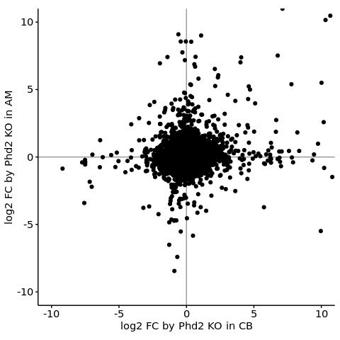
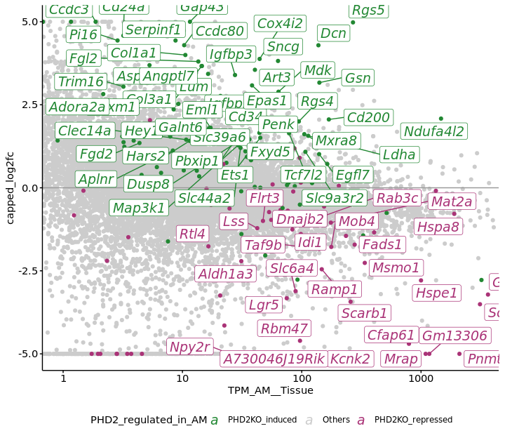
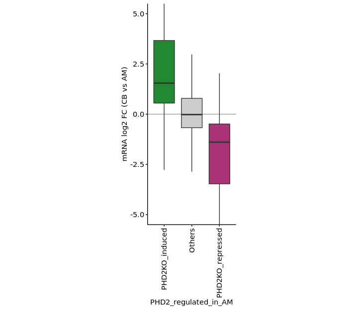
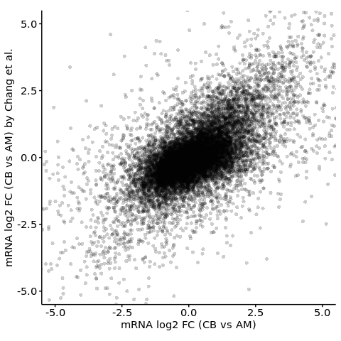
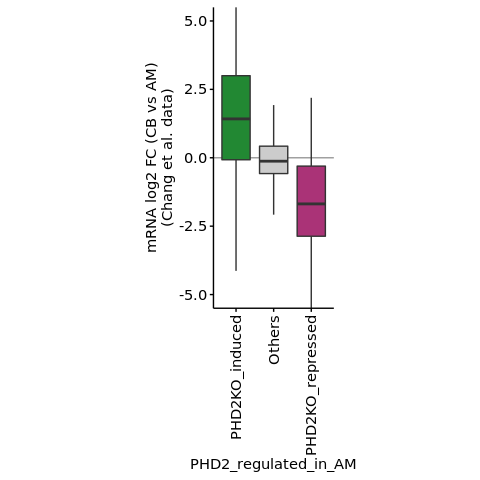

# Overview

Genes differentially expressed in the comparison of CB vs AM and that of Phd2KO vs wild-type AM are compared and their concordance will be analysed.

# Setup


```r
project.dir <- "/fast/AG_Sugimoto/home/users/yoichiro/projects/20230620_Phd2KO_in_AM_and_CB"
renv::restore("/fast/AG_Sugimoto/home/users/yoichiro/projects/20230620_Phd2KO_in_AM_and_CB/R")
```

```
## * The library is already synchronized with the lockfile.
```

```r
processors <- 7

temp <- sapply(list.files(
    file.path(project.dir, "R/functions"),
    full.names = TRUE
), source)

set.seed(1)
```

## The input and output files and the directories


```r
annot.dir <- file.path(project.dir, "annotation/")
annot.ps.dir <- file.path(annot.dir, "mm39_annotation/processed_data/")

results.dir <- file.path(project.dir, "results")
s2.dir <- file.path(results.dir, "s2")
s3.dir <- file.path(results.dir, "s3")

create.dirs(c(
    s3.dir
))
```

# Import data


```r
res.summary.dt <- fread(file.path(s2.dir, "all-de-results.csv"))

color.code <- c(
    "CB specific" = "#EE6677",
    "Others" = "gray80",
    "AM specific" = "#4477AA"
)

color.code.2 <- c(
    "PHD2KO_induced" = "#228833",
    "Others" = "gray80",
    "PHD2KO_repressed" = "#AA3377"
)

res.summary.dt[, `:=`(
    tissue_specific_genes = factor(tissue_specific_genes, levels = names(color.code)),
    tissue_specific_genes_Chang = factor(tissue_specific_genes_Chang, levels = names(color.code)),
    PHD2_regulated_in_AM = factor(PHD2_regulated_in_AM, levels = names(color.code.2)),
    PHD2_regulated_in_CB = factor(PHD2_regulated_in_CB, levels = names(color.code.2))
)]
```


# Definition of function


```r
library("matrixStats")
```

```
## 
## Attaching package: 'matrixStats'
```

```
## The following object is masked from 'package:dplyr':
## 
##     count
```

```r
plotMA <- function(res.summary.dt, data.postfix = "Tissue", data.vals = c("AM", "CB"), color.col, color.code, plot.title, log2fc_cap = 5){

    sl.dt <- copy(res.summary.dt)
    sl.dt[, `:=`(
        ave_TPM = rowMeans(cbind(
            get(paste0("TPM_", data.vals[1], "__", data.postfix)),
            get(paste0("TPM_", data.vals[2], "__", data.postfix))
        )),
        ave_log2fc = get(paste0("log2fc__", data.postfix))
    )]

    sl.dt[, `:=`(
        capped_log2fc = case_when(
            ave_log2fc > log2fc_cap ~ log2fc_cap,
            ave_log2fc < -log2fc_cap ~ -log2fc_cap,
            TRUE ~ ave_log2fc 
        ),
        capped_shape = case_when(
            abs(ave_log2fc) > log2fc_cap ~ 18,
            TRUE ~ 16
        )
    )]

    g1 <- ggplot(
        data = sl.dt[order(get(color.col) != "Others")],
        aes(
            x = ave_TPM,
            y = capped_log2fc,
            shape = as.character(capped_shape),
            color = get(color.col)
        )
    ) +

    geom_hline(yintercept = 0, color = "gray60") +
        geom_point() +
        scale_x_log10(
            breaks = scales::trans_breaks("log10", function(x) 10^x),
            labels = scales::trans_format("log10", scales::math_format(10^.x))
        ) +
        coord_cartesian(ylim = c(-log2fc_cap - 0.1, log2fc_cap + 0.1), xlim = c(1, 20000)) +
        scale_color_manual(values = color.code) +
        scale_shape_manual(values = c("16" = 16, "18" = 18), guide = "none") +
        theme(
            legend.position = "bottom",
            legend.title=element_blank(),
            aspect.ratio = 1
        ) +    
        xlab("Average mRNA abundance [TPM]") +
        ylab("log2fc in mRNA abudance") +
        ggtitle(plot.title)

    return(list(g = g1, sl.dt = sl.dt))

}
```

# Comparison of the effect of Phd2 KO in the CB and AM


```r
g.phd <- res.summary.dt[
    (TPM_WT__CB_PHD2KO > 10 | TPM_PHD2KO__CB_PHD2KO > 10 |
    TPM_WT__AM_PHD2KO > 10 | TPM_PHD2KO__AM_PHD2KO > 10) &
    !is.na(padj__CB_PHD2KO) & !is.na(padj__AM_PHD2KO)
] %T>%
    {print(paste0("n = ", nrow(.)))} %>%
    ggplot(
        aes(
            x = log2fc__CB_PHD2KO,
            y = log2fc__AM_PHD2KO
        )
    ) +
    geom_hline(yintercept = 0, color = "gray60") +
    geom_vline(xintercept = 0, color = "gray60") +
    geom_point() +
    coord_cartesian(xlim = c(-10, 10), ylim = c(-10, 10)) +
    theme(
        aspect.ratio = 1
    ) +
    xlab("log2 FC by Phd2 KO in CB") +
    ylab("log2 FC by Phd2 KO in AM")
```

```
## [1] "n = 9851"
```

```r
print(g.phd)
```

<!-- -->

```r
min.tpm.threshold <- 10

res.summary.dt[
(
    TPM_WT__CB_PHD2KO > min.tpm.threshold |
    TPM_PHD2KO__CB_PHD2KO > min.tpm.threshold |
    TPM_WT__AM_PHD2KO > min.tpm.threshold |
    TPM_PHD2KO__AM_PHD2KO > min.tpm.threshold
) &
!is.na(padj__CB_PHD2KO) & !is.na(padj__AM_PHD2KO)
]     %$%
    round(
        cor(
            log2fc__CB_PHD2KO, log2fc__AM_PHD2KO, method = "spearman"
        ),
        digits = 1
    )
```

```
## [1] 0.1
```


# Analysis of the concordance of differentially expressed genes in the comparison of CB vs AM and that of Phd2KO vs wild-type AM


```r
log2fc.cap <- 5

p.res.1 <- plotMA(
    res.summary.dt[
        !is.na(padj__Tissue) &
        !is.na(padj__AM_PHD2KO)
    ],
    data.postfix = "Tissue",
    data.vals = c("CB", "AM"),
    color.col = "PHD2_regulated_in_AM",
    color.code = color.code.2,
    plot.title = "CB vs AM\nPhd2 regulated genes in AM highlighted",
    log2fc_cap = log2fc.cap
)


p.res.1$sl.dt[order(padj__AM_PHD2KO, decreasing = TRUE)] %>%
    ggplot(
        aes(
            x = TPM_AM__Tissue,
            y = capped_log2fc,
            color = PHD2_regulated_in_AM
        )
    ) +
    geom_point() +
    geom_hline(yintercept = 0, color = "gray60") +
    ggrepel::geom_label_repel(aes(
                 label = ifelse(
                     tissue_specific_genes != "Others" &
                     PHD2_regulated_in_AM != "Others" &
                     sign(log2fc__Tissue) == sign(log2fc__AM_PHD2KO) &
                     gene_type == "protein_coding" &
                     (TPM_PHD2KO__AM_PHD2KO > 10 | TPM_WT__AM_PHD2KO > 10),
                     gene_name, NA                                                              
                 )
             ),
             max.overlaps = Inf, size = 5,
             xlim = c(NA, Inf), ylim = c(-NA, Inf),
             fontface = "italic"
             ) +
    scale_color_manual(values = color.code.2) +
    scale_x_log10(
        breaks = scales::trans_breaks("log10", function(x) 10^x)
    ) +
    coord_cartesian(xlim = c(1, 3000)) +
    theme(
        aspect.ratio = 0.8,
        legend.position = "bottom"
    )
```

```
## Warning: Transformation introduced infinite values in continuous x-axis
## Transformation introduced infinite values in continuous x-axis
```

```
## Warning: Removed 15137 rows containing missing values (geom_label_repel).
```

<!-- -->

```r
ggplot(
    data = p.res.1$sl.dt,
    aes(
        x = PHD2_regulated_in_AM,
        y = ave_log2fc,
        fill = PHD2_regulated_in_AM
    )
) +
    geom_hline(yintercept = 0, color = "gray60") +
    geom_boxplot(alpha = 1, outlier.shape = NA) +
    coord_cartesian(ylim = c(-log2fc.cap, log2fc.cap)) +
    scale_fill_manual(values = color.code.2, guide = "none") +
    scale_x_discrete(guide = guide_axis(angle = 90)) +
    theme(
        aspect.ratio = 2.5
    ) +
    ylab("mRNA log2 FC (CB vs AM)")
```

<!-- -->

```r
p.res.1$sl.dt[!is.na(ave_log2fc), table(PHD2_regulated_in_AM)]
```

```
## PHD2_regulated_in_AM
##   PHD2KO_induced           Others PHD2KO_repressed 
##              108            15032               75
```

```r
pval.tbl <- p.res.1$sl.dt %$%
    pairwise.wilcox.test(
        x = ave_log2fc,
        g = PHD2_regulated_in_AM,
        p.adjust.method = "none"
    )$p.value

p.adjust(c(
    pval.tbl["Others", "PHD2KO_induced"], pval.tbl["PHD2KO_repressed", "Others"]
))
```

```
## [1] 1.189947e-23 2.740920e-17
```

# Confirmation of the results above using orthogonal data


```r
ggplot(
    data = res.summary.dt[
        !is.na(padj__Tissue) & !is.na(padj__Tissue_Chang)
    ],
    aes(
        x = log2fc__Tissue,
        y = log2fc__Tissue_Chang
    )
) +
    geom_point(alpha = 0.2, shape = 16) +
    theme(
        aspect.ratio = 1
    ) +
    coord_cartesian(xlim = c(-5, 5), ylim = c(-5, 5)) +
    xlab("mRNA log2 FC (CB vs AM)") +
    ylab("mRNA log2 FC (CB vs AM) by Chang et al.")
```

<!-- -->

```r
res.summary.dt[
    !is.na(padj__Tissue) & !is.na(padj__Tissue_Chang)
] %$%
    cor.test(
        x = log2fc__Tissue, y = log2fc__Tissue_Chang,
        method = "pearson"
    )
```

```
## 
## 	Pearson's product-moment correlation
## 
## data:  log2fc__Tissue and log2fc__Tissue_Chang
## t = 105.04, df = 16234, p-value < 2.2e-16
## alternative hypothesis: true correlation is not equal to 0
## 95 percent confidence interval:
##  0.6268631 0.6451806
## sample estimates:
##       cor 
## 0.6361115
```

```r
res.summary.dt[
    !is.na(padj__Tissue) & !is.na(padj__Tissue_Chang)
] %$%
    cor.test(
        x = log2fc__Tissue, y = log2fc__Tissue_Chang,
        method = "spearman"
    )
```

```
## Warning in cor.test.default(x = log2fc__Tissue, y = log2fc__Tissue_Chang, :
## Cannot compute exact p-value with ties
```

```
## 
## 	Spearman's rank correlation rho
## 
## data:  log2fc__Tissue and log2fc__Tissue_Chang
## S = 2.7083e+11, p-value < 2.2e-16
## alternative hypothesis: true rho is not equal to 0
## sample estimates:
##       rho 
## 0.6203308
```

```r
p.res.2 <- plotMA(
    res.summary.dt[
        !is.na(padj__Tissue_Chang) & !is.na(padj__AM_PHD2KO)
    ],
    data.postfix = "Tissue_Chang",
    data.vals = c("CB", "AM"),
    color.col = "PHD2_regulated_in_AM",
    color.code = color.code.2,
    plot.title = "CB vs AM (Chang et al.)\nPhd2 regulated genes in AM highlighted",
    log2fc_cap = log2fc.cap
)

ggplot(
    data = p.res.2$sl.dt,
    aes(
        x = PHD2_regulated_in_AM,
        y = ave_log2fc,
        fill = PHD2_regulated_in_AM
    )
) +
    geom_hline(yintercept = 0, color = "gray60") +
    geom_boxplot(alpha = 1, outlier.shape = NA) +
    coord_cartesian(ylim = c(-log2fc.cap, log2fc.cap)) +
    scale_fill_manual(values = color.code.2, guide = "none") +
    scale_x_discrete(guide = guide_axis(angle = 90)) +
    theme(
        aspect.ratio = 2.5
    ) +
    ylab("mRNA log2 FC (CB vs AM)\n(Chang et al. data)")
```

<!-- -->

```r
p.res.2$sl.dt[!is.na(ave_log2fc), table(PHD2_regulated_in_AM)]
```

```
## PHD2_regulated_in_AM
##   PHD2KO_induced           Others PHD2KO_repressed 
##              114            15315               80
```

```r
pval2.tbl <- p.res.2$sl.dt %$%
    pairwise.wilcox.test(
        x = ave_log2fc,
        g = PHD2_regulated_in_AM,
        p.adjust.method = "none"
    )$p.value

p.adjust(c(
    pval2.tbl["Others", "PHD2KO_induced"], pval2.tbl["PHD2KO_repressed", "Others"]
))
```

```
## [1] 9.308047e-17 7.395189e-15
```


# Session information


```r
sessioninfo::session_info()
```

```
## ─ Session info ───────────────────────────────────────────────────────────────
##  setting  value
##  version  R version 4.2.1 (2022-06-23)
##  os       CentOS Linux 7 (Core)
##  system   x86_64, linux-gnu
##  ui       X11
##  language (EN)
##  collate  en_GB.UTF-8
##  ctype    en_GB.UTF-8
##  tz       Europe/Berlin
##  date     2023-06-23
##  pandoc   2.19.2 @ /fast/AG_Sugimoto/home/users/yoichiro/software/miniconda3/envs/20220601_CB_AM_PHD2/bin/ (via rmarkdown)
## 
## ─ Packages ───────────────────────────────────────────────────────────────────
##  package     * version date (UTC) lib source
##  BiocManager   1.30.18 2022-05-18 [1] CRAN (R 4.2.1)
##  bslib         0.4.0   2022-07-16 [1] CRAN (R 4.2.1)
##  cachem        1.0.6   2021-08-19 [1] CRAN (R 4.2.1)
##  cli           3.4.1   2022-09-23 [1] CRAN (R 4.2.1)
##  colorspace    2.0-3   2022-02-21 [1] CRAN (R 4.2.1)
##  data.table  * 1.14.4  2022-10-17 [1] CRAN (R 4.2.1)
##  digest        0.6.30  2022-10-18 [1] CRAN (R 4.2.1)
##  dplyr       * 1.0.10  2022-09-01 [1] CRAN (R 4.2.1)
##  evaluate      0.17    2022-10-07 [1] CRAN (R 4.2.1)
##  fansi         1.0.3   2022-03-24 [1] CRAN (R 4.2.1)
##  farver        2.1.1   2022-07-06 [1] CRAN (R 4.2.1)
##  fastmap       1.1.0   2021-01-25 [1] CRAN (R 4.2.1)
##  generics      0.1.3   2022-07-05 [1] CRAN (R 4.2.1)
##  ggplot2     * 3.3.6   2022-05-03 [1] CRAN (R 4.2.1)
##  ggrepel       0.9.1   2021-01-15 [1] CRAN (R 4.2.1)
##  glue          1.6.2   2022-02-24 [1] CRAN (R 4.2.1)
##  gtable        0.3.1   2022-09-01 [1] CRAN (R 4.2.1)
##  highr         0.9     2021-04-16 [1] CRAN (R 4.2.1)
##  htmltools     0.5.3   2022-07-18 [1] CRAN (R 4.2.1)
##  jquerylib     0.1.4   2021-04-26 [1] CRAN (R 4.2.1)
##  jsonlite      1.8.2   2022-10-02 [1] CRAN (R 4.2.1)
##  khroma      * 1.9.0   2022-06-18 [1] CRAN (R 4.2.1)
##  knitr       * 1.40    2022-08-24 [1] CRAN (R 4.2.1)
##  labeling      0.4.2   2020-10-20 [1] CRAN (R 4.2.1)
##  lifecycle     1.0.3   2022-10-07 [1] CRAN (R 4.2.1)
##  magrittr    * 2.0.3   2022-03-30 [1] CRAN (R 4.2.1)
##  matrixStats * 0.62.0  2022-04-19 [1] CRAN (R 4.2.1)
##  munsell       0.5.0   2018-06-12 [1] CRAN (R 4.2.1)
##  pillar        1.8.1   2022-08-19 [1] CRAN (R 4.2.1)
##  pkgconfig     2.0.3   2019-09-22 [1] CRAN (R 4.2.1)
##  R6            2.5.1   2021-08-19 [1] CRAN (R 4.2.1)
##  Rcpp          1.0.9   2022-07-08 [1] CRAN (R 4.2.1)
##  renv          0.16.0  2022-09-29 [1] CRAN (R 4.2.1)
##  rlang         1.0.6   2022-09-24 [1] CRAN (R 4.2.1)
##  rmarkdown   * 2.17    2022-10-07 [1] CRAN (R 4.2.1)
##  sass          0.4.2   2022-07-16 [1] CRAN (R 4.2.1)
##  scales        1.2.1   2022-08-20 [1] CRAN (R 4.2.1)
##  sessioninfo   1.2.2   2021-12-06 [1] CRAN (R 4.2.1)
##  stringi       1.7.8   2022-07-11 [1] CRAN (R 4.2.1)
##  stringr     * 1.4.1   2022-08-20 [1] CRAN (R 4.2.1)
##  tibble        3.1.8   2022-07-22 [1] CRAN (R 4.2.1)
##  tidyselect    1.2.0   2022-10-10 [1] CRAN (R 4.2.1)
##  utf8          1.2.2   2021-07-24 [1] CRAN (R 4.2.1)
##  vctrs         0.4.2   2022-09-29 [1] CRAN (R 4.2.1)
##  withr         2.5.0   2022-03-03 [1] CRAN (R 4.2.1)
##  xfun          0.34    2022-10-18 [1] CRAN (R 4.2.1)
##  yaml          2.3.6   2022-10-18 [1] CRAN (R 4.2.1)
## 
##  [1] /fast/AG_Sugimoto/home/users/yoichiro/software/miniconda3/envs/20220601_CB_AM_PHD2/lib/R/library
## 
## ──────────────────────────────────────────────────────────────────────────────
```
